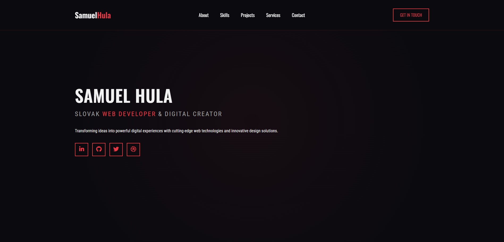

# Samuel Hula - Developer Portfolio

<div align="center">
  
</div>

<br>

## 🌟 Overview

Professional portfolio website showcasing Samuel Hula's development skills, projects, and services. Built with modern web technologies and featuring a sleek, dark theme with vibrant accent colors.

<div class="card">
  <div class="header">
    <h3>Portfolio Highlights</h3>
  </div>
  <div class="content">
    <ul>
      <li>✨ Modern dark UI with red accent elements</li>
      <li>🚀 Fully responsive design</li>
      <li>🎯 Project showcase with detailed case studies</li>
      <li>📱 Mobile-first approach</li>
      <li>⚡ Optimized performance</li>
    </ul>
  </div>

</div>
## 🚀 Features

| Feature               | Description                                                                 |
|-----------------------|-----------------------------------------------------------------------------|
| **Responsive Design** | Optimized for all devices from mobile to desktop                            |
| **Project Showcase**  | Detailed case studies with skills used and project status indicators       |
| **Technical Skills**  | Interactive skills grid with categorized expertise                          |
| **Contact Section**   | Professional contact information with availability status                  |
| **Modern UI**         | Dark theme with vibrant accents, smooth animations, and clean typography   |

## 🛠 Technologies Used

<div align="center">
  
  
  
  
  
</div>

## 🎨 Design System

```css
:root {
  --dark-bg: #0a0a0f;
  --card-bg: #121218;
  --accent-red: #e63946;
  --accent-blue: #3a86ff;
  --text-light: #f1f1f1;
  --text-gray: #a0a0a0;
}


